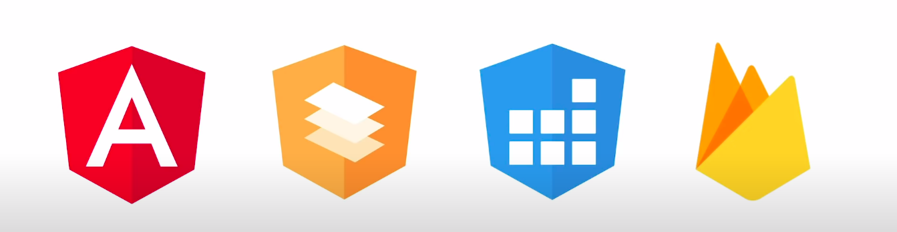

# KanbanFire 🔥
### About project
This project simulates a Kanban Board using Angular CLI and Firebase.

See more about it [here](https://en.wikipedia.org/wiki/Kanban_board).

### Stack used

<p>
    
</p>

- Angular CLI
- Firebase
- Angular Material
- Angular SDK
- AngularFire

## How to run this project
```bash
npm install
# and
npm start
```

### Demo

https://user-images.githubusercontent.com/65451957/148661853-bfcf2e48-7f33-4079-9a39-0e66e2f7ec24.mp4

🔗 Link to the demo: [https://kanban-fire-a10a2.web.app/](https://kanban-fire-a10a2.web.app)

### Contributions
Feel free to contribute to this project, if you find any bugs or improvements, open an issue and send a PR about it \o/
